   
   <h3 align="center">¡Hey 👋! Soy Diego 👨🏻‍💻</h3>

Soy Programador y Administrador de Sistemas con años experiencia. ¡Revisa mi contenido 👇!

   
   
  
  

<!--
https://github.com/anuraghazra/github-readme-stats#github-stats-card
-->
<!--

 

-->
